# Sử dụng Grafana và Prometheus để monitor windows

Để giảm sát được các server Windows, chúng ta cần phải cài đặt wmi\_exporter (Agent collectors) để Promethues có thể thu thập được metric từ các server Windows này.

**Nếu các bạn chỉ đơn thuần download các agent này cài đặt vào máy chủ Windows thì bạn chỉ có thể thu thập metric ở mức cơ bản, như hình ở bên trên. Dưới dây là hướng dẫn bạn thu thập metric của những services nâng cao cho service Windows. Ví dụ như: AD, DNS, SQL, IIS, …**

Bước 1: Download wmi\_exporter (bản mới nhất thì nó sẽ được đổi tên thành windows\_exporter). Anh em chú ý để edit trong file dashboard nha.&#x20;

Link download Agent: [https://github.com/prometheus-community/windows\_exporter/releases](https://github.com/prometheus-community/windows\_exporter/releases)

Có 2 phiên bản Agent:

**wmi\_exporter.exe** (click to run, dành cho các bạn nào chỉ cần các metric được enable sẵn).

**wmi\_exporter.msi** (dùng để cài đặt thông qua CMD, enable các tính năng thu thập metric nâng cao).

**Khi cài agent qua CMD sẽ giúp các bạn chọn lọc thu thập những loại metric nào cần thu thập, giảm các loại metric không cần thiết, có thể thu thập nhiều loại metric hơn mặc định.**

Mở **port 9115** trên server linux, và windows server.

Bước 2: Mở CMD hoặc Powershell quyền Administrator, bạn có thể sử dụng các bước như dưới để mở nhanh Powershell với quyền Administrator.

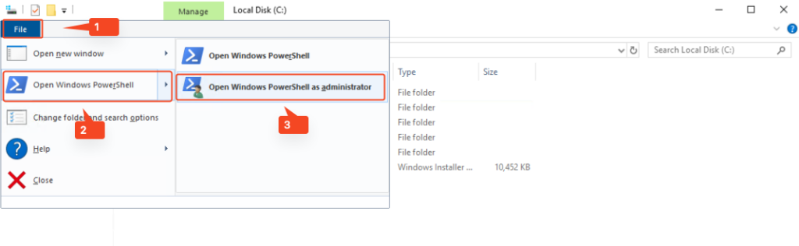

Di chuyển đến nơi chứa file windows\_exporter-0.20.0-386.msi vừa tải về, trường hợp của mình file này đang đặt tại ổ đĩa C:\\

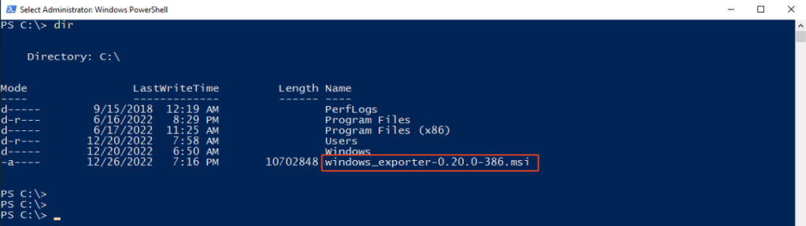

Bước 3: Chạy comment _msiexec_ với cú pháp như sau:

msiexec /i windows\_exporter-0.20.0-386.msi ENABLED\_COLLECTORS="ad,adfs,cache,cpu,cpu\_info,cs,container,dfsr,dhcp,dns,fsrmquota,iis,logical\_disk,logon,memory,msmq,mssql,netframework\_clrexceptions,netframework\_clrinterop,netframework\_clrjit,netframework\_clrloading,netframework\_clrlocksandthreads,netframework\_clrmemory,netframework\_clrremoting,netframework\_clrsecurity,net,os,process,remote\_fx,service,tcp,time,vmware" TEXTFILE\_DIR="C:\custom\_metrics" LISTEN\_PORT="9115"

Nếu không có lỗi xảy ra, bạn sẽ thấy hiển thị nhanh 1 hộp thoại tiến trình cài đặt, cài đặt hoàn thành khi hộp thoại đó biến mất và màn hình Powershell sẽ không có thông báo gì cho bạn như ở dưới.

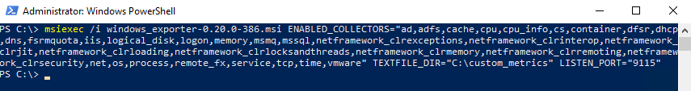

_**ENABLED\_COLLECTORS=**_**”**các loại metric cần thu thập, tên của loại metric trong hình bên trên**”**

_**Tùy theo từng loại windows server mà lựa chọn metric cho phù hợp.**_

Bước 4: Kết quả sau khi cài đặt xong:

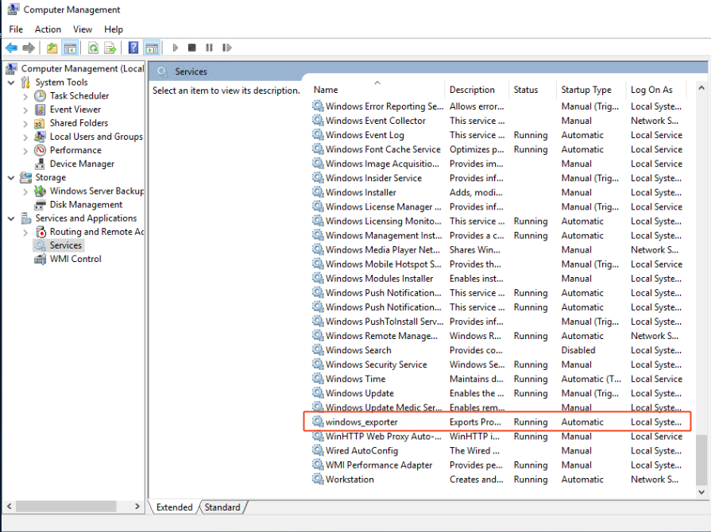

Bước 5: Kiểm tra metric bạn truy cập như sau: _http://ipserver:9115_/metrics

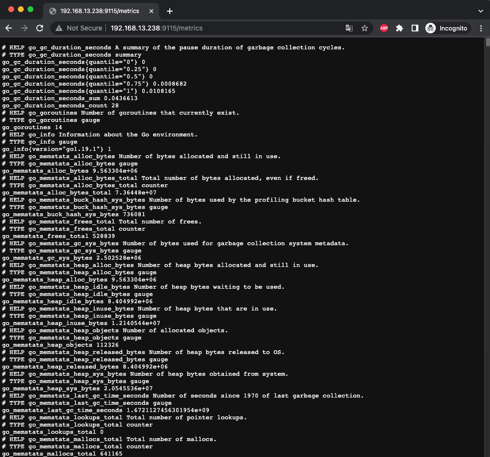

Bước 6: Cấu hình cho Prometheus.

Tạo job trong prometheus để giám sát Windows Server này với nội dung sau, bạn thêm nội dung sau vào file prometheus.yml. Tại đây mình thêm trường labels vào để dễ dàng filter metric. Tương tự nếu bạn muốn add nhiều server windows trên cùng 1 job, bạn chỉ cần copy đoạn target và edit lại thông tin.

\- job\_name: 'HyperV01'

static\_configs:

\- targets: \['192.168.13.236:9115']

labels:

hostname: HyperV01

_type_: windows

company: mipec

\- job\_name: 'HyperV02'

static\_configs:

\- targets: \['192.168.13.237:9115']

labels:

hostname: HyperV02

_type_: windows

company: mipec

\- job\_name: 'HyperV03'

static\_configs:

\- targets: \['192.168.13.238:9115']

labels:

hostname: HyperV03

_type_: windows

company: mipec

Bước 7: Restart serivce prometheus

systemctl restart prometheus

systemctl status prometheus

Bước 8: Kiểm tra lại host được thêm vào prometheus thành công hay không. Truy cập vào Prometheus sau đó chọn Status, target để kiểm tra.

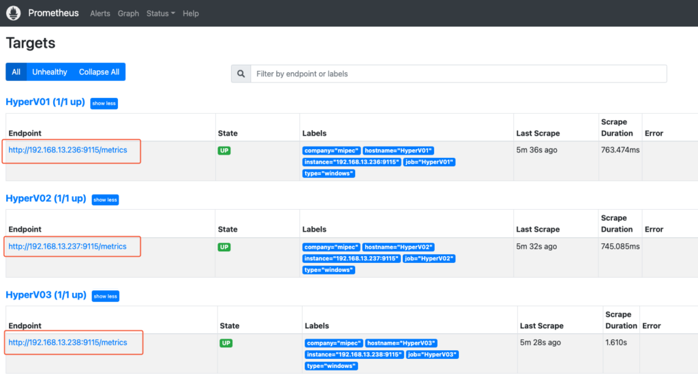

Hãy thử test 1 querry, bạn có kết quả như hình.

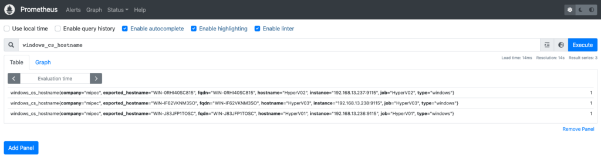

Bước 9: Tạo Dashboard monitor Windows server trên Grafana.

Vào trang https://grafana.com/grafana/dashboards/14694-windows-exporter-dashboard/ tải file json dashboard về hoặc copy ID của dashboard đó.

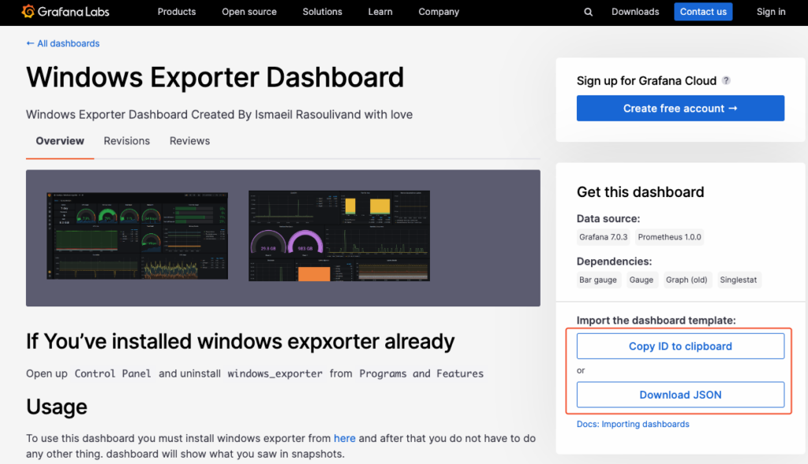

Truy cập vào **Grafana**, sau đó chọn **Manage Dashboards** như hình:

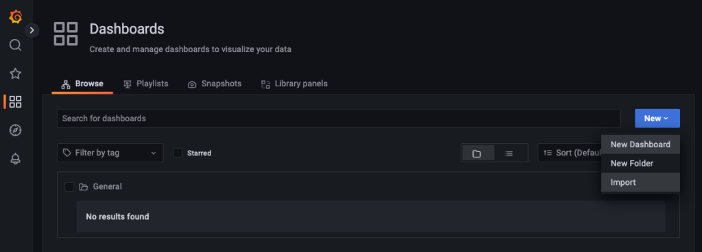

Nếu bạn sử dụng import bằng ID thì hãy điền ID vào như hình dưới.

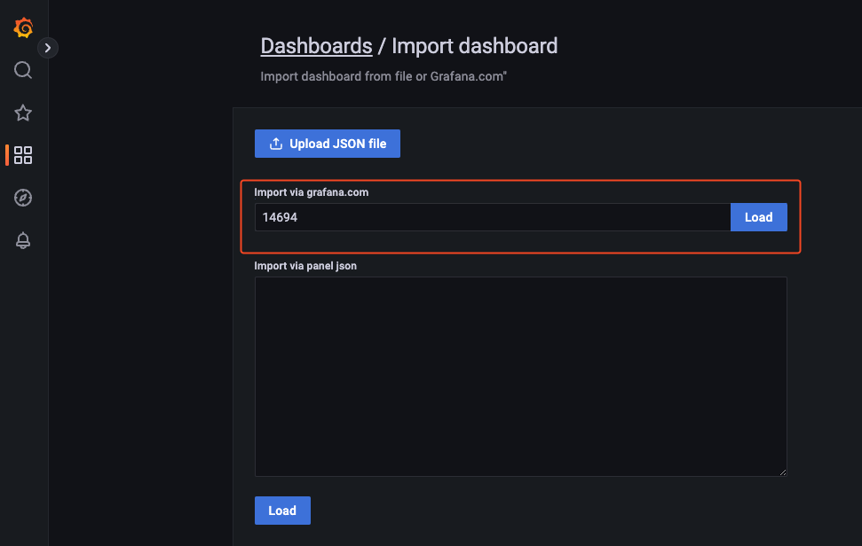

Còn nếu sử dụng import bằng file json thì bạn hãy tải file json của dashboard về và upload nó vào Grafana hoặc copy nội dung file json và dán vào mục 2 và bấm load như hình.

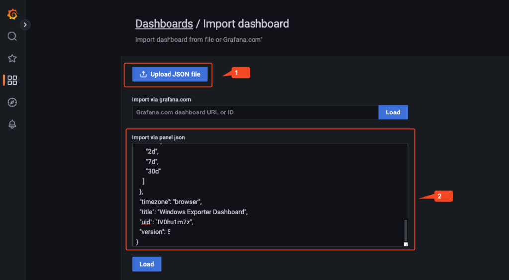

Sau khi load xong bạn sẽ thấy thông tin của dashboard, bạn có thể thay đổi tên hoặc folder chứa dashboard và đừng quên chọn datasource của bạn.

_**Các tham số cần chú ý:**_

**Name :** tên của dashboard.

**Folder :** thư mục chứa dashboard.

**UID :** số định danh của dashboard, nếu số này trùng thì khi bạn import dashboard củ sẽ bị ghi đè.

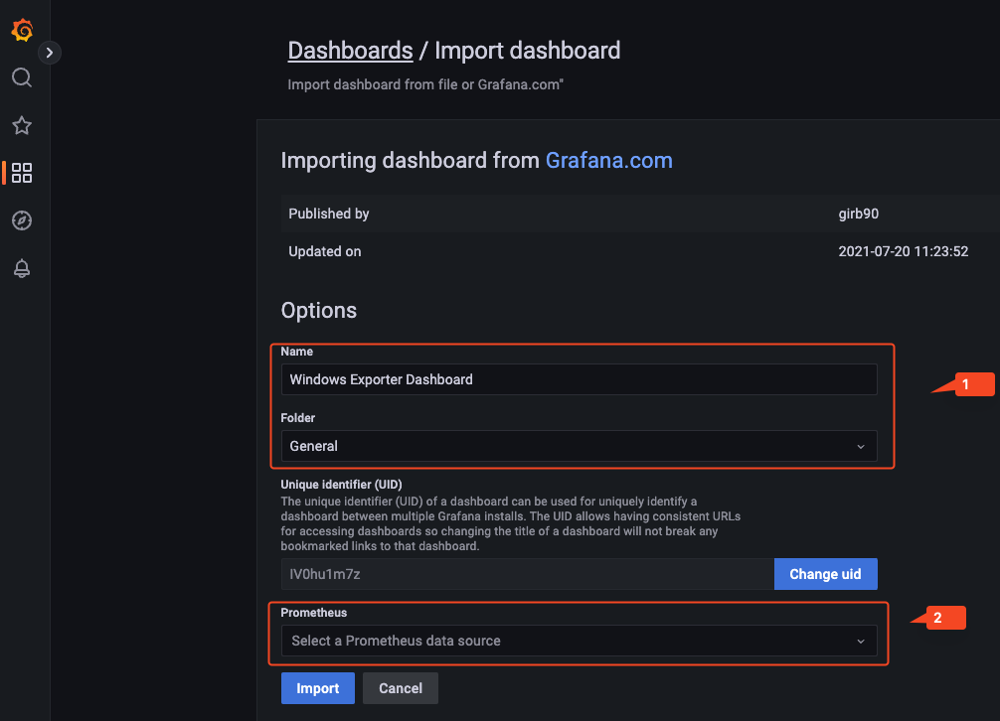

Đây là kết quả sau khi bạn import dashboard thành công.

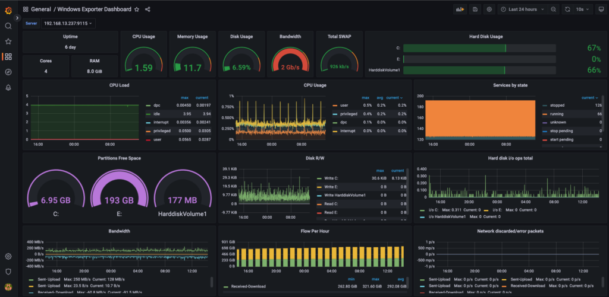

**Như vậy chúng ta có thể ứng dụng hướng dẫn này để giám sát dịch vụ AD, DNS, SQL, IIS, …**&#x20;
